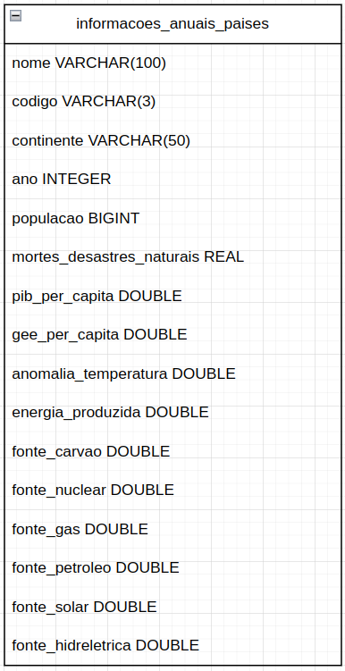

# Considerações
Escolhemos o DuckDB como banco não relacional para nosso projeto principalmente pelo contexto analítico de nosso dataset e pela performance do banco.
O fato do DuckDB armazenar os dados em colunas no lugar de linhas facilita a leitura de apenas das colunas necessárias para a consulta.
A linguagem de consultas é o SQL padrão, o que facilitou bastante nossa adaptação. O duck possui também funções analíticas otimizadas para cargas de trabalho OLAP que ajudaram a acelerar nossas consultas, mesmo que o volume de dados não seja assim tão grande.
Apesar de ser um banco orientado a análise e não transações concorrentes de escrita, o DuckDB implementa um modelo de controle de transações ACID (Atomicidade, Consistência, Isolamento e Durabilidade) com base em MVCC (Multi-Version Concurrency Control) o que é o suficiente para garantir isolamento entre leituras e gravações e a integridade dessas operações. Como nosso cenário envolvia majoritariamente consultas de leitura e análises, o controle de transações não chegou a ser uma grande preocupação para nõs.
A recuperação no Duck também é simplificada, pois podemos simplesmente copiar o arquivo do banco, quando estamos no modo persistente. No quesito segurança, esse banco é projetado para uso local. Caso seja necessário acesso multiusuário, por exemplo, devemos utilizar ferramentas externas para adicionar camadas de autenticação

# Modelo lógico:

